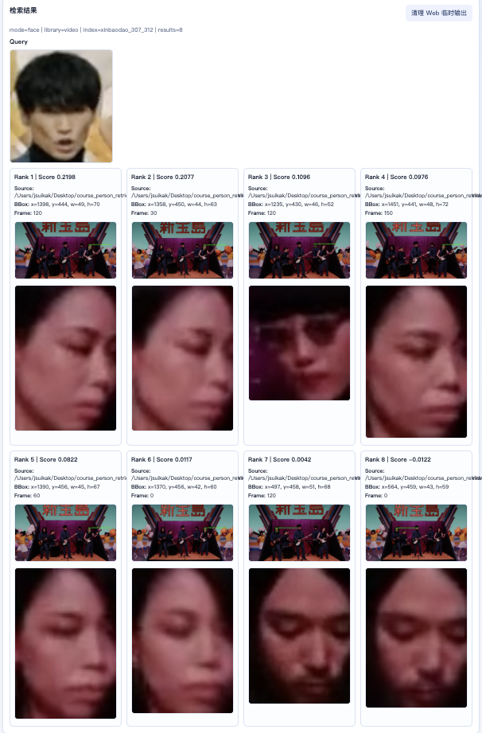
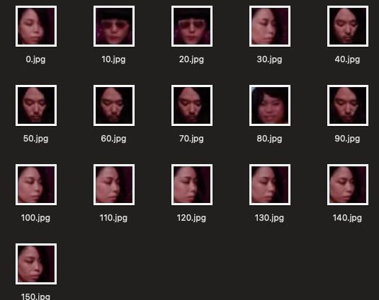
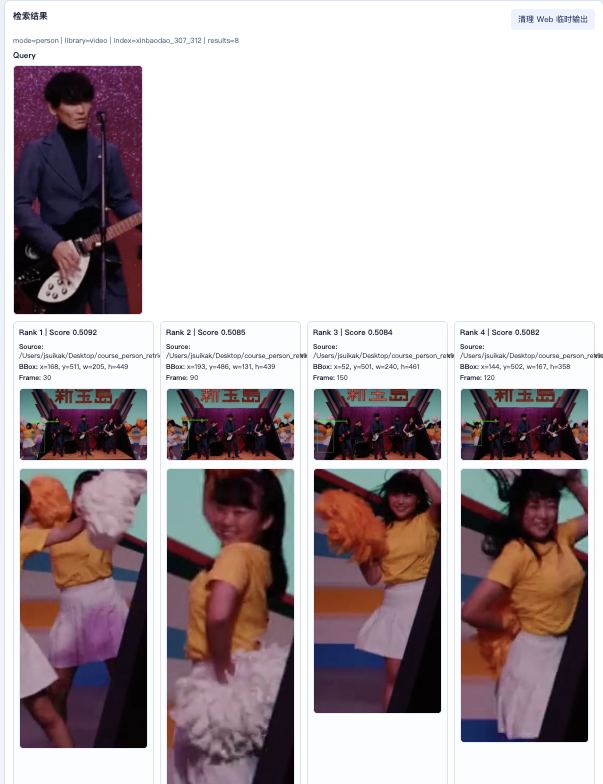
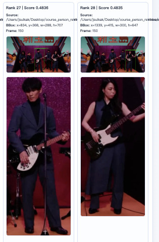
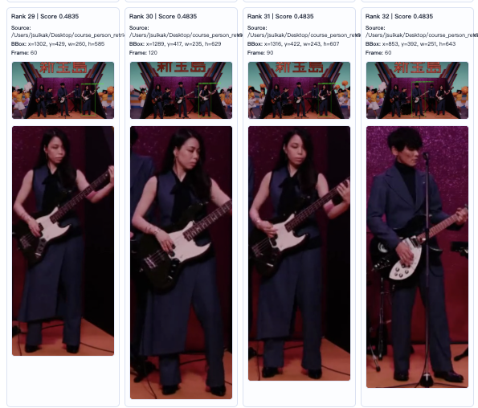
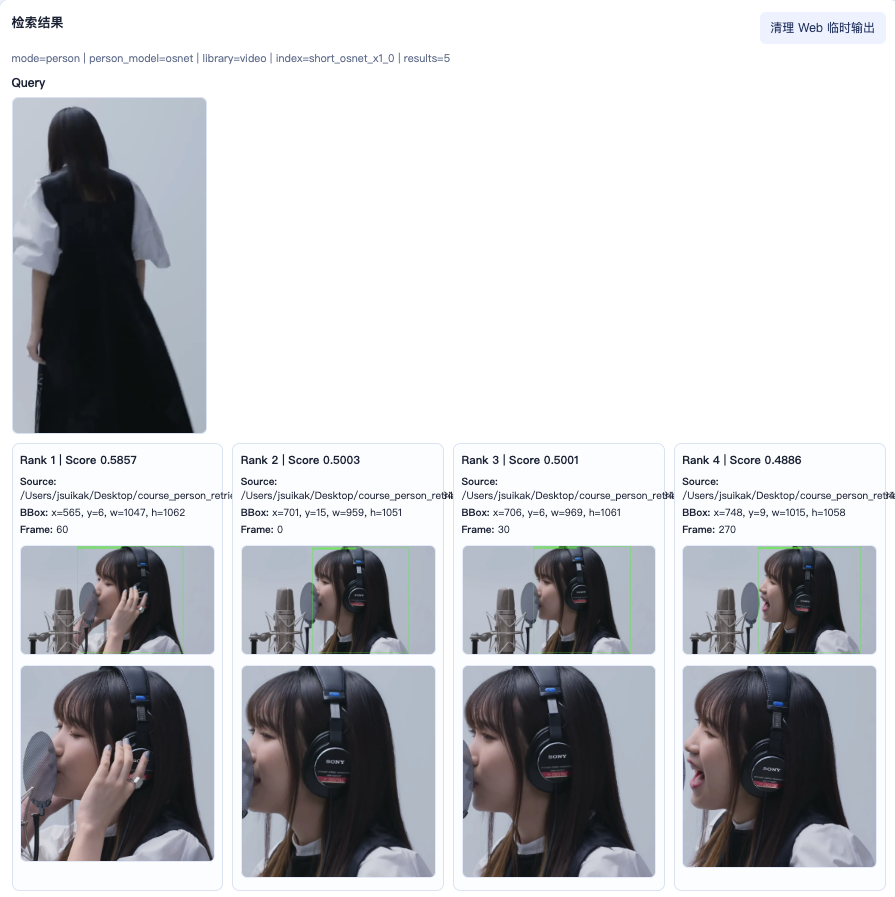
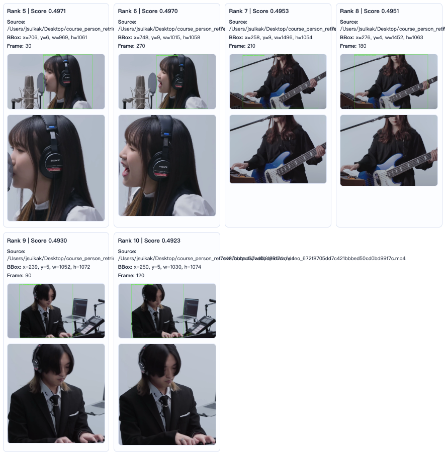

## 新宝岛mv

### 人脸特征模式（ArcFace特征）

主唱人脸匹配不上。人脸输入来自同mv的另一片段（场景1），库来自场景2

后来运行mtcnn脚本发现人脸没检测出来

分析可能是眼睛被刘海遮住的原因

### 不限特征模式（ResNet特征）

使用半身检索也是效果不好

分析可能是YOLO识别到的人太多了，但是这些不相关的人得分占前列也说明特征没有把他们分得很开

事实上，调高topk后在rank27处匹配成功

考虑到服装和乐器的相似程度，也是个比较好的局部结果

## Yoasobi TFT

### 不限特征模式（YOLO+OSNet特征）

不算非常bad的case，算是局限性

使用OSNet特征在全身/半身的特征提取上是比较好的，但是实际执行检索的时候遇到另一个由YOLO引发的问题。

检索流程中会先用YOLO检索，检索到人物后和query的特征进行匹配，问题在于YOLO得到的框可能是肩上部分/半身/全身，而query如果不是这些对应的情况，在特征匹配可能效果差一些。

这不是YOLO的问题也不是OSNet的问题，主要是目前没有很好的做法对齐query和库的裁剪。

对于结果上，虽然query是半身，库中检索到肩上视角，还是能把人物以高分数检索出来，说明虽然有局限性，OSNet的输出特征还是很好地学习到了针对人的表达（单纯ResNet做不到这一点）

