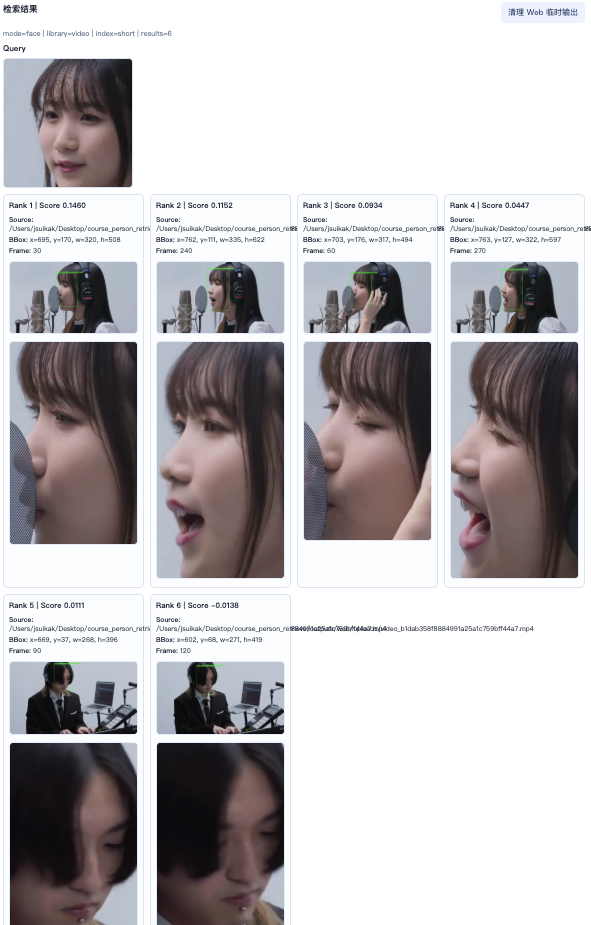
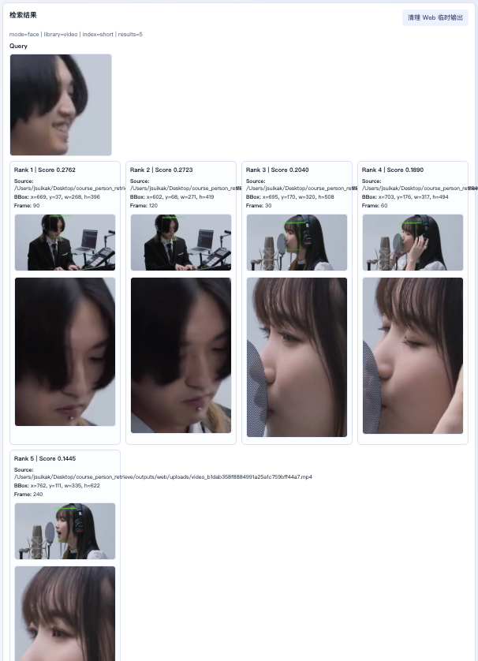
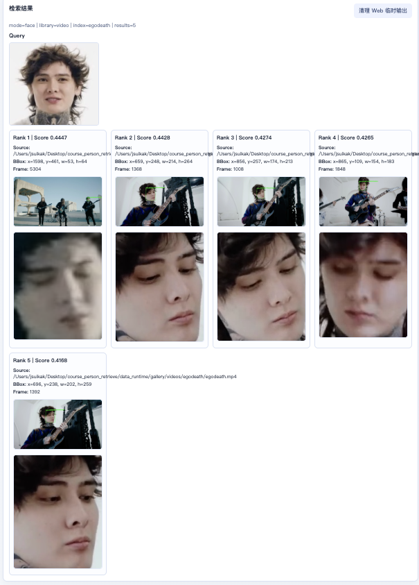
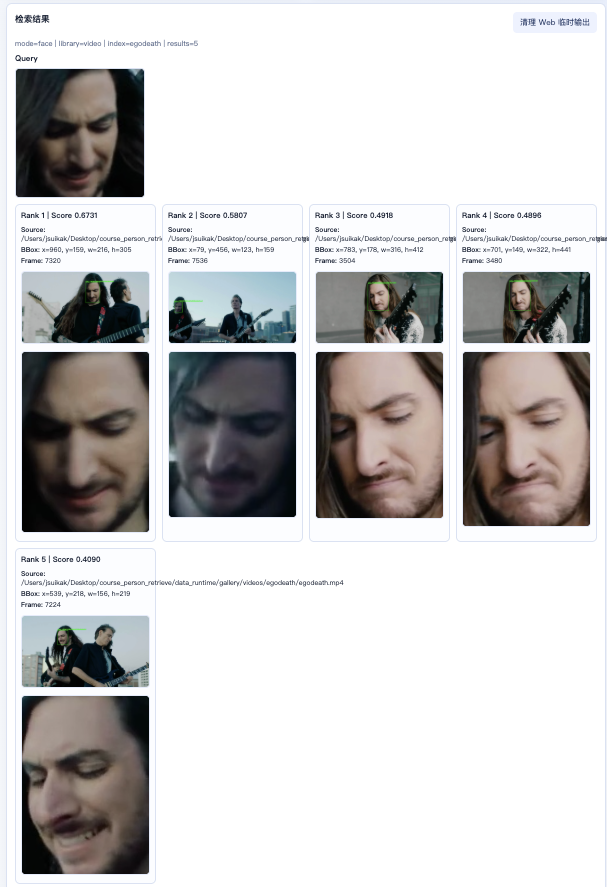
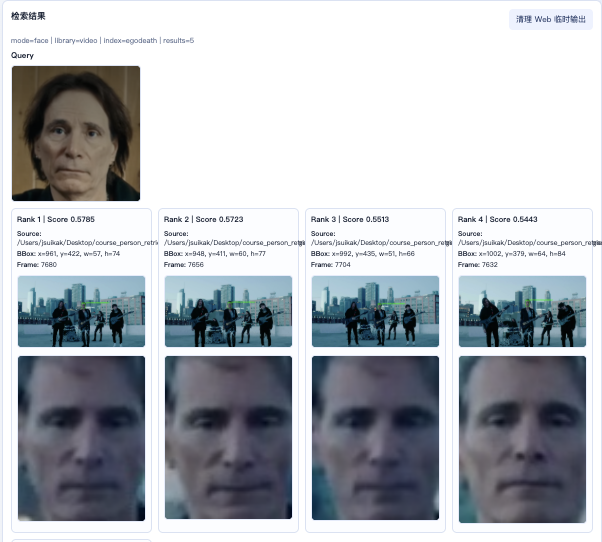
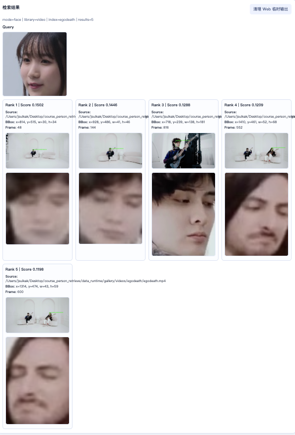
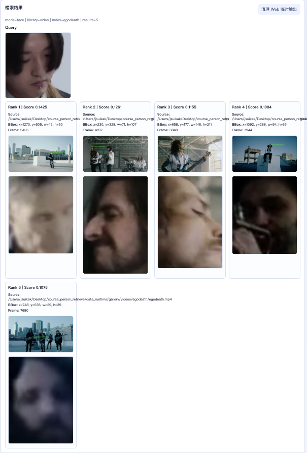
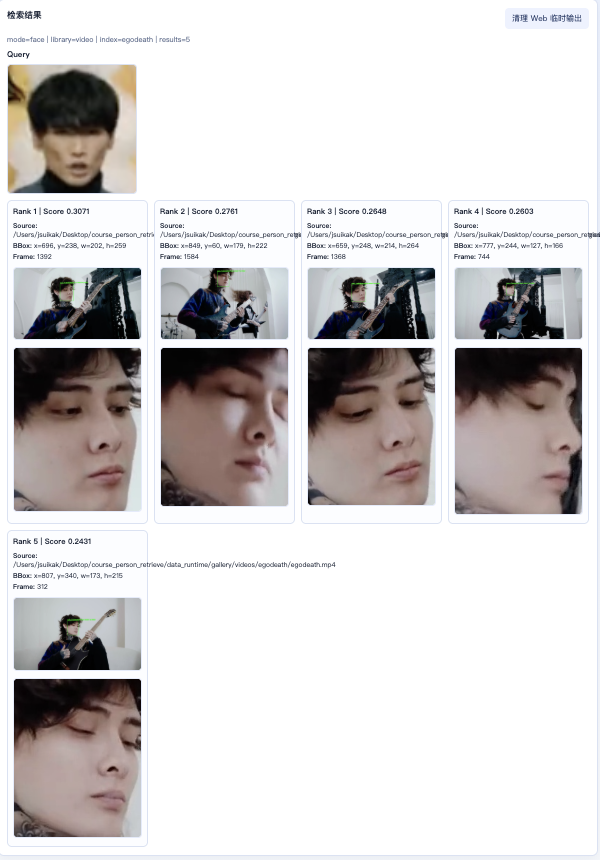
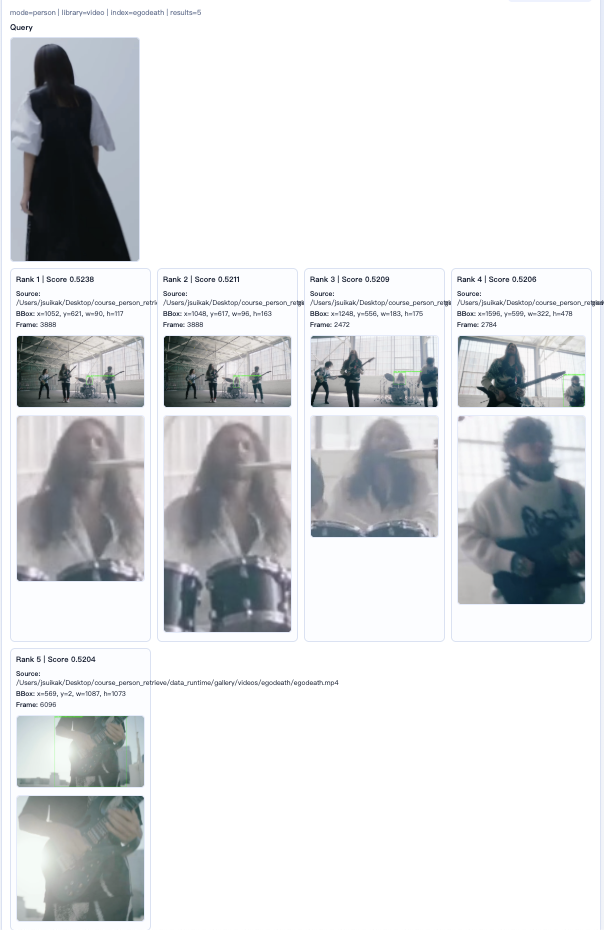
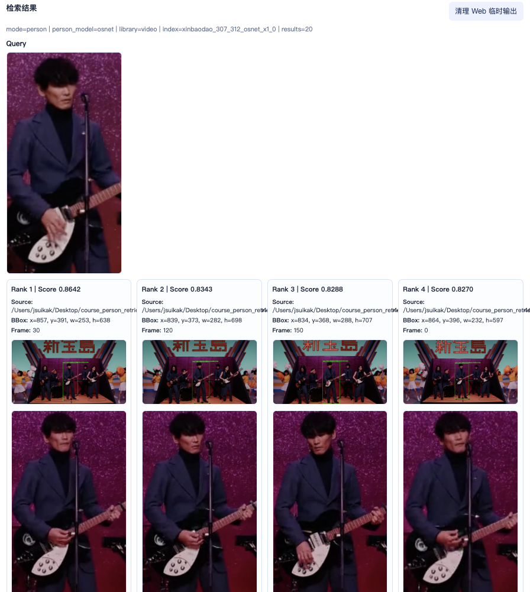

## YOASOBI TFT

### 人脸特征模式（ArcFace特征）

输入同MV的人脸

效果还行，但是得分偏低

### 不限特征模式（OSNet特征）

见bad case，但是检索特征本身没什么问题

### 不限特征模式（ResNet特征）

bad case

## Ego Death MV

### 人脸特征模式（ArcFace特征）

Query来自其他视频

效果相对好得多，分数也高

同样的查询，不用Face模式，用Person模式（ResNet）的结果，效果显然变差：

#### 用陌生人匹配

尝试用ikura和ayase的脸去匹配，得到的分数也相对偏低，说明人脸的特征有一定的区分度

另外，用ikura，person模式（ResNet）匹配，会发现得到的分数比较高，是一个比较奇怪的结果：

## 新宝岛MV

### 人脸特征模式（ArcFace特征）

未成功，收录到bad case

### 不限特征模式（OSNet特征）

