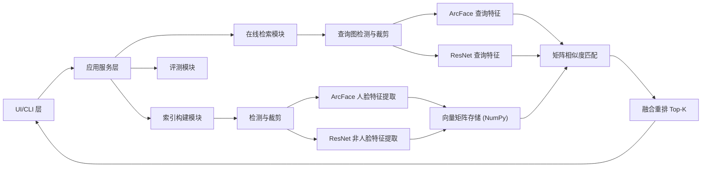

# 课程作业需求分析与初步架构设计（ArcFace + ResNet，矩阵检索版）

## 1. 文档目的

本项目目标是完成课程作业中的双算法人物检索系统：

1. 基于人脸特征的识别检索（ArcFace）。
2. 基于非人脸特征的识别匹配（ResNet 提取全身/半身特征）。

系统需支持图像库和视频库检索、Top-K 返回，以及在自建标注测试集上的量化评估。

---

## 2. 场景与问题定义

### 2.1 业务场景

实际图像或视频中存在以下情况：

1. 人脸清晰可见，可直接做人脸识别。
2. 人脸模糊、遮挡、角度偏大，单独做人脸识别会失败。

因此系统需要双分支识别：优先利用人脸特征，同时使用非人脸特征兜底，提高鲁棒性。

### 2.2 输入与输出

输入：

1. 查询图像（单人，可能是人脸图或全身/半身图）。
2. 待检索库（图像库或视频库）。

输出：

1. Top-K 检索结果（样本路径、得分、身份标签）。
2. 评估指标（Rank-1、Recall@K、mAP）。

---

## 3. 用户流程（课程作业版）

1. 上传查询人物图像。
2. 选择检索库类型（图像库/视频库）与数据路径。
3. 点击“建立索引”：
   - 人物检测/人脸检测；
   - 裁剪局部图像（face crop、body crop）；
   - 提取 ArcFace 与 ResNet 特征；
   - 将特征写入向量矩阵文件。
4. 点击“匹配”：
   - 对查询图提取双分支特征；
   - 与库矩阵做相似度计算；
   - 融合分数并返回 Top-K。
5. 在标注测试集上执行评测，输出指标表。

---

## 4. 功能需求

### 4.1 核心功能需求

1. `FR-01` 查询输入：支持上传单张查询图像。
2. `FR-02` 库选择：支持图像库与视频库两种检索目标。
3. `FR-03` 索引构建：支持检测、裁剪、特征提取与保存。
4. `FR-04` 人脸分支：采用 ArcFace 提取 512 维人脸向量。
5. `FR-05` 非人脸分支：采用 ResNet 提取全身/半身向量（建议 2048 维或降维后向量）。
6. `FR-06` 匹配检索：支持余弦相似度 Top-K 检索。
7. `FR-07` 融合策略：支持双分支分数融合；若人脸缺失/低质量，自动降低人脸权重。
8. `FR-08` 评测：支持在自建标注集上输出 Rank-1、Recall@K、mAP。

### 4.2 非功能需求

1. 小规模数据集可在 CPU 上运行完成。
2. 索引文件可复用，避免重复提特征。
3. 模块化设计，便于后续替换模型或添加新特征。
4. 输出日志和实验配置，确保复现。

---

## 5. 总体架构设计（初版）

---

## 6. 数据与索引设计（不使用 FAISS）

### 6.1 建议的索引文件

1. `face_features.npy`：形状 `[N, Df]`，ArcFace 特征矩阵。
2. `body_features.npy`：形状 `[N, Db]`，ResNet 特征矩阵。
3. `meta.csv`：每一行对应一个样本，含 `sample_id, identity, source_path, frame_id, bbox`。
4. `index_info.json`：记录模型版本、维度、构建时间、样本数。

### 6.2 相似度检索实现

假设所有特征已做 L2 归一化：

1. 人脸相似度：`S_face = F_face @ q_face`
2. 非人脸相似度：`S_body = F_body @ q_body`
3. 融合得分：`S = alpha * S_face + (1 - alpha) * S_body`
4. 用 `argpartition + argsort` 取 Top-K 索引并返回结果。

`alpha` 建议规则：

1. 人脸检测失败：`alpha = 0`
2. 人脸质量低（模糊/尺寸小）：`alpha` 降低（如 `0.2~0.4`）
3. 人脸清晰：`alpha` 提高（如 `0.6~0.8`）

---

## 7. 关键算法说明

### 7.1 人脸识别分支（ArcFace）

1. 输入：人脸裁剪图。
2. 输出：512 维 embedding。
3. 用途：在人脸清晰场景下提供高判别能力。

### 7.2 非人脸识别分支（ResNet）

1. 输入：全身/半身人物裁剪图。
2. 输出：ResNet backbone 的全局特征向量（可加投影层降维）。
3. 用途：在人脸模糊、遮挡、侧脸等场景下提供补充识别能力。

### 7.3 融合策略

1. 早期版本使用线性加权，便于解释与调试。
2. 后续可扩展为质量感知融合（根据人脸清晰度、检测置信度动态设权重）。

---

## 8. 评测方案（自建测试集）

### 8.1 数据组织

1. `gallery`：每个身份若干参考样本（图像/视频帧）。
2. `query`：每个身份若干查询样本。
3. 需包含“清晰人脸样本”和“模糊/遮挡样本”。

### 8.2 指标

1. `Rank-1`
2. `Recall@K`（K=1,5,10）
3. `mAP`
4. 可选：平均查询耗时、索引构建耗时

### 8.3 对比实验

1. 仅 ArcFace（人脸分支）。
2. 仅 ResNet（非人脸分支）。
3. ArcFace + ResNet 融合（主方案）。

---

## 9. 手动实现向量匹配的潜在缺点

在课程作业中使用“NumPy 向量矩阵 + 逐次匹配”是可行的，但存在以下不足：

1. 计算复杂度高：单次查询通常是 `O(N*D)`，库变大后查询明显变慢。
2. 扩展性差：数据规模上去后，CPU 内存带宽成为瓶颈，不适合高并发。
3. 内存占用高：全量特征常驻内存，样本数增长会快速增加内存压力。
4. 更新不够友好：增量添加样本后，常需要重写或重载矩阵文件。
5. 缺少工程能力：没有成熟向量库的压缩索引、近似检索、持久化优化等能力。
6. 检索鲁棒性受限：只能“暴力相似度 + 排序”，难以利用复杂检索策略提升召回效率。
7. 代码维护成本上升：手写检索细节（归一化、Top-K、批处理）容易引入边界 bug。

结论：课程作业阶段采用手动矩阵匹配可快速落地；若后续扩展到大规模系统，应迁移到专业向量检索方案。

---

## 10. 实施里程碑（建议）

1. 第 1 周：完成数据清洗、标注格式定义、基础检测与裁剪。
2. 第 2 周：完成 ArcFace + ResNet 双分支特征提取与矩阵索引。
3. 第 3 周：完成检索融合、Top-K 展示与评测脚本。
4. 第 4 周：完成对比实验、误差分析与报告整理。
