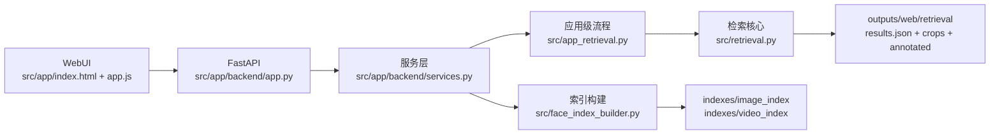
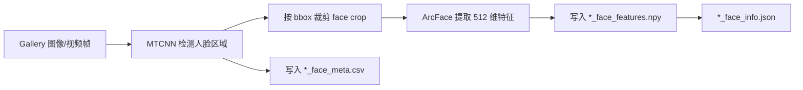
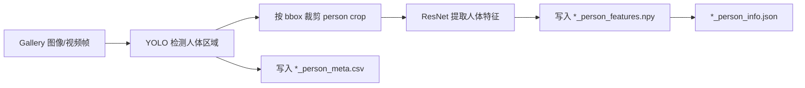

# 课程作业需求分析与架构设计（基于当前实现）

## 1. 文档目的

本文档用于描述当前版本人物检索系统的：

1. 需求分析（用户要完成什么任务）。
2. 架构设计（系统如何按模块实现这些任务）。
3. 算法流程（索引构建与查询匹配如何落地）。

说明：本文内容以仓库现有实现为准，不再使用“初步架构”表述。

---

## 2. 需求分析

### 2.1 业务目标

系统目标是为课程作业提供可运行、可演示的双模式人物检索能力：

1. `face` 模式：适用于人脸清晰可见场景。
2. `person` 模式：适用于人体外观检索场景。

系统既要支持图像库检索，也要支持视频库检索，并输出可视化结果用于分析。

### 2.2 WebUI 核心功能需求

围绕 WebUI，系统提供 3 个核心功能：

1. `手动建立索引`
2. `查询-图像库匹配`
3. `查询-视频库匹配`

这 3 个功能对应用户最常见的操作闭环：

1. 先建索引（或由系统自动建索引）
2. 再发起检索
3. 查看可视化结果

### 2.3 功能需求清单

1. `FR-01` 手动建立索引：用户输入库路径、选择模式、设置索引名，系统构建并持久化索引。
2. `FR-02` 查询-图像库匹配：上传查询图 + 指定图库路径，返回 Top-K 结果。
3. `FR-03` 查询-视频库匹配：上传查询图 + 上传视频，返回 Top-K 结果。
4. `FR-04` 模式切换：每次任务可选择 `face` 或 `person`，两者分别使用独立索引。
5. `FR-05` 结果展示：返回 `rank/score/source/bbox/frame` 及 `annotated/crop` 可视化图。
6. `FR-06` 索引复用：索引存在时优先复用，避免重复构建。

### 2.4 非功能需求

1. 可在 CPU 环境运行。
2. 模块化实现，便于后续替换检测器或特征提取模型。
3. 输出目录结构稳定，便于课程展示与复现。

---

## 3. 架构设计（基于现有实现）

### 3.1 分层与模块

模块职责：

1. `WebUI`：参数输入、任务触发、结果展示。
2. `API 层`：接收请求、参数校验、路由分发。
3. `服务层`：组织索引构建/检索流程，处理上传文件与输出路径。
4. `索引构建模块`：按 `face/person` 模式提取 gallery 特征并落盘。
5. `检索模块`：提取 query 特征、与对应索引匹配、输出 Top-K 与可视化产物。

### 3.2 WebUI 三个功能的架构映射

### A) 手动建立索引

1. 前端表单：`手动构建索引`。
2. API：`POST /api/admin/rebuild-gallery-index`。
3. 服务调用：`rebuild_gallery_index(...) -> build_feature_index(...)`。
4. 输出：`indexes/*_index/<index_name>_<mode>_{features,meta,info}.*`。

### B) 查询-图像库匹配

1. 前端标签页：`图片检索图库`。
2. API：`POST /api/search/gallery`。
3. 服务调用：`search_gallery(...) -> run_app_retrieval_flow(...)`。
4. 特性：索引缺失时自动构建，再执行检索。

### C) 查询-视频库匹配

1. 前端标签页：`图片检索上传视频`。
2. API：`POST /api/search/uploaded-video`。
3. 服务调用：`search_uploaded_video(...) -> search_gallery(...)`。
4. 特性：上传视频先落地到 `outputs/web/uploads/`，随后按“视频库检索”流程处理。

---

## 4. 算法与流程设计（对齐当前实现）

### 4.1 索引构建流水线一：MTCNN + ArcFace（face）

用于构建 `face` 模式索引。

实现入口：

1. `src/face_index_builder.py`（`feature_mode=face`）
2. `src/face_feature_pipeline.py`

### 4.2 索引构建流水线二：YOLO + ResNet（person）

用于构建 `person` 模式索引。

实现入口：

1. `src/face_index_builder.py`（`feature_mode=person`）
2. `src/person_feature_pipeline.py`

### 4.3 查询图像与匹配策略（重点）

查询图像不做“face/person 双分支同时提取与融合”，而是按用户选择的模式单路执行：

1. 选择 `face` 模式：
   - 使用 ArcFace 对查询图提取特征。
   - 仅与 `*_face_features.npy` 索引库做匹配。
2. 选择 `person` 模式：
   - 使用 ResNet 对查询图提取特征。
   - 仅与 `*_person_features.npy` 索引库做匹配。

匹配规则：

1. 对 query/gallery 特征做 L2 归一化。
2. 用余弦相似度（归一化后点积）计算 `score`。
3. 按 `score` 降序返回 Top-K。

实现入口：

1. `src/retrieval.py`
2. `src/tools/feature_extractor.py`

---

## 5. 数据与输出设计

### 5.1 索引文件

1. `*_face_features.npy` / `*_person_features.npy`：特征矩阵。
2. `*_face_meta.csv` / `*_person_meta.csv`：来源路径、帧号、bbox 等元数据。
3. `*_face_info.json` / `*_person_info.json`：样本数、维度、构建信息。

### 5.2 检索输出

每次检索输出目录（Web 场景）：

1. `outputs/web/retrieval/<query>-<index>-<mode>/results.json`
2. `outputs/web/retrieval/<...>/crops/`
3. `outputs/web/retrieval/<...>/annotated/`

结果字段重点：`rank`, `score`, `source_name`, `bbox`, `frame_index`。

---

## 6. 当前版本边界与后续扩展

当前版本边界：

1. 已实现单模式检索（`face` 或 `person` 二选一）。
2. 未实现 face/person 双分支分数融合。
3. 未实现在线增量索引更新（以离线重建为主）。

可扩展方向：

1. 增加质量感知融合策略（face + person）。
2. 引入更大规模向量检索方案（替代纯矩阵全量匹配）。
3. 增加评测面板与自动化实验管理。
